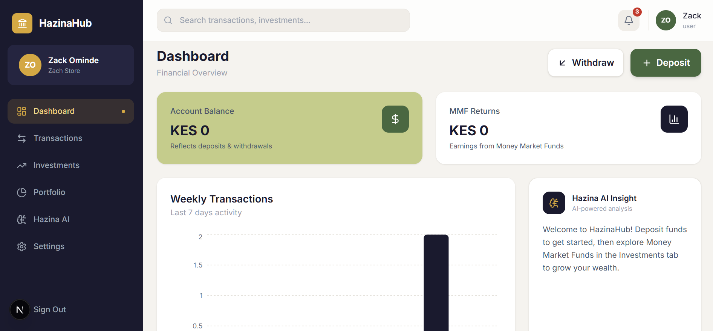
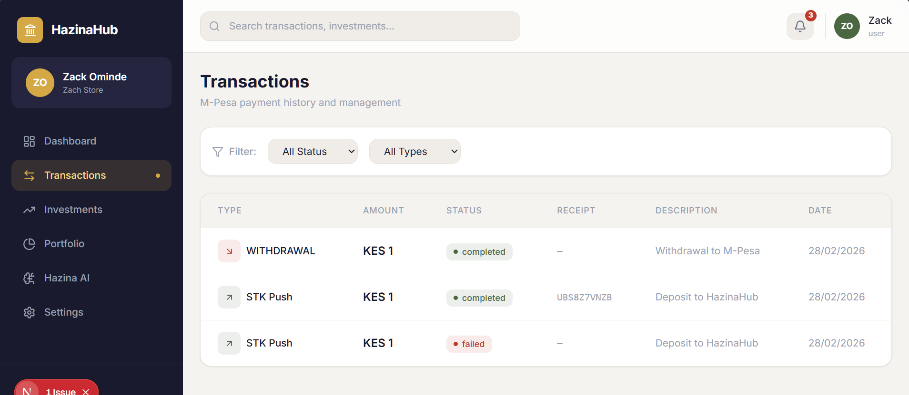
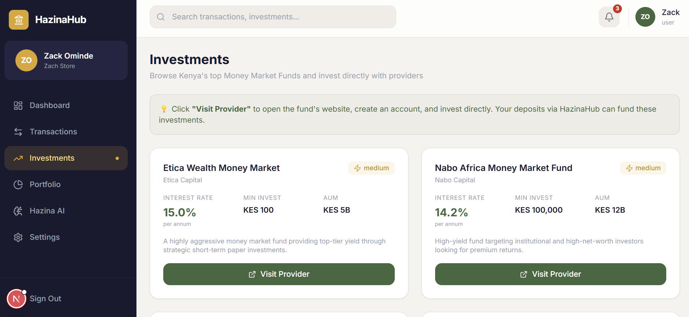
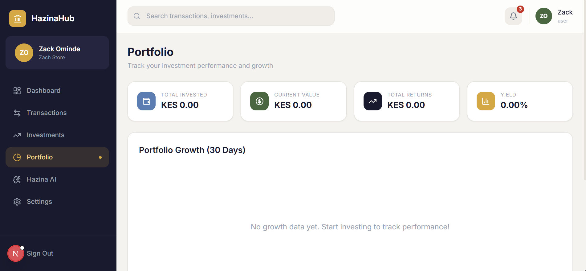
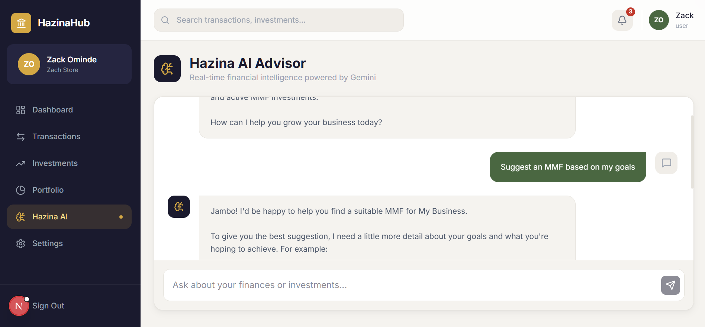

<h1 align="center">HazinaHub 💸</h1>

<p align="center">
  <strong>A Next-Generation Personal Finance & Investment Platform for Kenya.</strong>
</p>

<p align="center">
  HazinaHub seamlessly unites secure mobile money transacting (M-Pesa), real-time financial tracking, dynamic Money Market Fund (MMF) investing, and an embedded AI financial advisor powered by Google Gemini.
</p>

---

## 📸 Screenshots

|                       Dashboard & Tracking                       |                            Investments                             |
| :--------------------------------------------------------------: | :----------------------------------------------------------------: |
|  |  |

|                        M-Pesa Integration                         |                       AI Chat Advisor                       |
| :---------------------------------------------------------------: | :---------------------------------------------------------: |
|  |  |

<p align="center">
  
</p>

---

## 🌟 Key Features

- 📱 **Native M-Pesa Integration:** Secure API integration with Safaricom Daraja for C2B deposits (STK Push) and B2C withdrawals straight to your phone.
- 📈 **Dynamic MMF Investments:** Browse and invest in top Kenyan Money Market Funds (CIC, Sanlam, Nabo) featuring realistically simulated live yields driven by native MongoDB cron jobs.
- 🤖 **Hazina AI Advisor:** An embedded, context-aware financial advisor powered by the Google Gemini API. Hazina AI reads your actual spending metrics to give you personalized, actionable advice.
- 📊 **Automated Analytics:** Track your weekly and monthly spending habits with beautiful Recharts data visualizations and an automated "Financial Health" score.
- 🔒 **Secure & Scalable:** Fully protected by JWT authentication middleware and backed by a robust MongoDB Atlas database.

## 🛠 Tech Stack

**Frontend:**

- React 18 & Next.js (App Router)
- Tailwind CSS
- Zustand (State Management)
- Recharts (Data Visualization)
- Axios

**Backend:**

- Node.js & Express
- Mongoose & MongoDB Atlas
- Safaricom M-Pesa Daraja API
- Google Gemini AI API
- Node-cron (for dynamic yield calculation)

## 🚀 Getting Started

### Prerequisites

- Node.js (v18+)
- MongoDB Cluster URI
- Safaricom Daraja API keys (Consumer Key, Secret, Passkey)
- Google Gemini API Key

### Installation

1. **Clone the repository:**

   ```bash
   git clone https://github.com/n3osnipher/HazinaHub.git
   cd HazinaHub
   ```

2. **Install dependencies:**
   This project uses Turborepo workspaces.

   ```bash
   npm install
   ```

3. **Set up Environment Variables:**
   Create a `.env` file in the root directory and configure the variables (see `.env.example`).

   ```env
   # Example Variables
   JWT_SECRET=your_jwt_secret
   MONGO_URI=your_mongodb_connection_string
   MPESA_CONSUMER_KEY=your_key
   GEMINI_API_KEY=your_gemini_key
   ```

4. **Run the Development Server:**
   ```bash
   npm run dev
   ```
   _The Next.js frontend runs on `http://localhost:3000` and the Express API runs on `http://localhost:5000`._

## 🤝 Contributing

Contributions, issues, and feature requests are welcome! Feel free to check the [issues page](../../issues).

## 📄 License

This project is [MIT](https://choosealicense.com/licenses/mit/) licensed.
